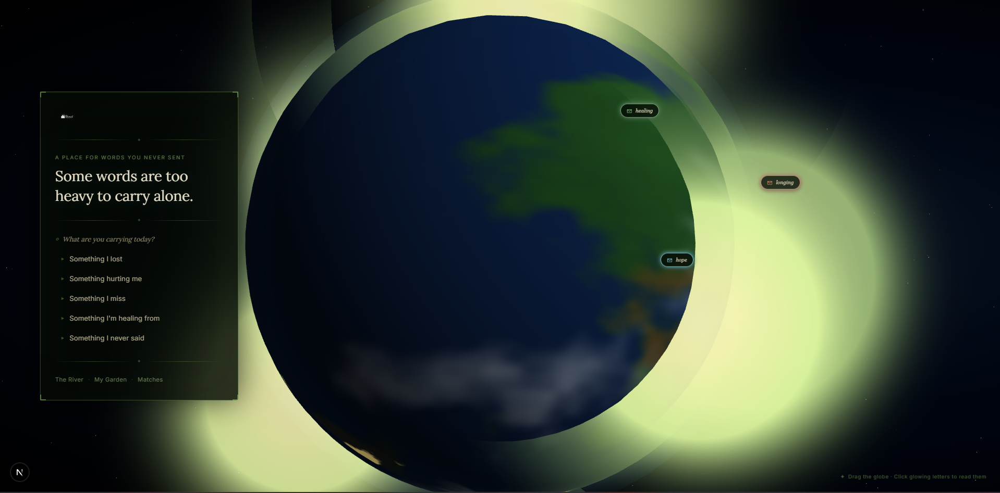

Unsent — anonymous journaling with LLM-driven emotion analysis.

Some words are too heavy to carry alone — Unsent is a reflective journaling platform that lets people write short "unsent" letters. The app analyzes each letter with an LLM to surface emotions, build a personal "garden" of themes, and gently connect people via emotion-based matches.



Table of Contents
- Features
- Tech stack
- Architecture overview
- Getting started
- Environment variables
- Database & Prisma
- Authentication
- API endpoints
- Background jobs & analysis
- Frontend & UI highlights
- Development scripts
- Deployment
- File structure
- Design notes
- Contributing
- License
 
## Features
- Write private or public unsent letters
- Automated emotion analysis (Anthropic)
- Personal "garden" that groups letters into themes (seeds)
- Matching based on emotional similarity
- Background job queue with retry/backoff for analysis
- WebGL-powered landing scene with an interactive globe

## Tech stack
- **Framework:** Next.js (App Router) + TypeScript
- **DB & ORM:** PostgreSQL (Neon recommended) + Prisma
- **Auth:** NextAuth with Prisma adapter (Google provider)
- **LLM:** Anthropic via `@anthropic-ai/sdk`
- **Realtime / Messaging:** Pusher (server + client)
- **Rendering:** Server + client components; custom WebGL scene for the landing page

## Architecture overview
- Frontend: `src/app/*` pages and React components. `LandingScene` is a client-side WebGL canvas that renders the globe, stars, and garden points.
- API: Route handlers in `src/app/api/*` implement REST endpoints for letters, matches, profile data, and job processing.
- Services: `src/services/*` encapsulate domain logic (emotion analysis, garden updates, matching).
- Persistence: Prisma models (see `prisma/schema.prisma`) for `User`, `Letter`, `Seed`, `Match`, `Message`, `AnalysisJob`, etc.
- Background work: `src/lib/queue.ts` enqueues jobs; `/api/jobs/process` (and the cron route) processes analysis jobs with retry/backoff.

## Getting started
Prerequisites:
- Node >= 18
- A PostgreSQL-compatible database (Neon recommended)
- `pnpm`, `npm` or `yarn`

Install and run locally:
```bash
npm install
# generate prisma client
npx prisma generate
# (optional) create migration files for local schema changes
npx prisma migrate dev --create-only --name init
# dev server
npm run dev
```

## Environment variables
Create a `.env` with at least:
- `DATABASE_URL` — Postgres connection string (Neon recommended)
- `NEXTAUTH_URL` — e.g. `http://localhost:3000`
- `GOOGLE_CLIENT_ID`, `GOOGLE_CLIENT_SECRET` — NextAuth Google OAuth
- `ANALYTIC_API_KEY` (optional)
- `ANALYSIS_API_KEY` / `ANTHROPIC_API_KEY` — LLM API key used by `analyzeLetter`
- `JOB_SECRET` — protects `/api/jobs/process` in production
- `PUSHER_APP_ID`, `PUSHER_KEY`, `PUSHER_SECRET` (if using Pusher)

## Database & Prisma
- Prisma schema: `prisma/schema.prisma` (generator outputs to `src/generated/prisma`)
- Migrations are in `prisma/migrations/`
- The project uses the Neon adapter in `src/lib/prisma.ts` (PrismaNeon)

Commands:
```bash
npx prisma generate
npx prisma migrate dev --name <migration_name>
```

## Authentication
- NextAuth is configured in `src/lib/auth.ts` with the Prisma adapter.
- Sessions use the database (`strategy: 'database'`) and new users are assigned an `anonymousName`.

## API endpoints (selected)
- `POST /api/letters` — create a letter (auth required). Enqueues analysis job.
- `GET  /api/letters` — list public analyzed letters (supports `?emotion=`).
- `GET  /api/letters/[letterId]` — fetch a single letter.
- `GET  /api/jobs/process` — process pending analysis jobs (protected by `JOB_SECRET` in production).
- `GET  /api/jobs/cron` — scheduled cron route (configured in `vercel.json`).

## Background jobs & analysis
- Letters are saved immediately and an `AnalysisJob` is created (`src/lib/queue.ts`).
- `src/services/emotion.service.ts` calls Anthropic to classify emotion, intensity, category, seedTheme, and tags.
- `src/services/garden.service.ts` groups letters into seeds, updates stages (SEED → STRONG), and maintains seed tags and counts.
- Jobs are retried with exponential backoff and fail safely (letters are marked `FAILED` after retries).

## Frontend & UI highlights
- `src/components/LandingScene.tsx` — a custom WebGL scene (globe, atmosphere, stars, glowing garden points). It reads public letters and maps them to world locations.
- Left-panel UI in `src/app/page.tsx` shows CTAs and navigation; many components are server components for fast initial load.

## Development scripts
- `npm run dev` — Next.js dev server
- `npm run build` — build for production
- `npm start` — start built server
- `npm run lint` — run ESLint

## Deployment
- Vercel is the recommended host. `vercel.json` contains a cron entry for `/api/jobs/cron`.
- Ensure environment variables are set in Vercel (DB, NextAuth, Anthropic, JOB_SECRET, Pusher).
- For production job processing, use Vercel Cron or an external scheduler to invoke `/api/jobs/process` with `x-job-secret`.

## File structure 
- `src/app` — pages (app router)
- `src/components` — client components (LandingScene, Nav, etc.)
- `src/app/api` — API route handlers
- `src/services` — domain logic (emotion, garden, match)
- `src/lib` — helpers (prisma, auth, queue)
- `prisma` — schema & migrations
- `src/generated/prisma` — generated Prisma client

## Design notes & decisions
- Emotion analysis uses Anthropic with a strict system prompt to return a validated JSON structure.
- Garden / seed model lets the app group related letters into themes for longer-term user journeys.
- Matching is vector-based: `src/services/match.service.ts` builds per-user emotion vectors and uses cosine similarity to suggest matches.
- The landing experience favors an ambient WebGL scene to create an emotional tone.

## Contributing
- PRs welcome. Please open issues for feature requests or bugs.
- Run `npm run lint` and ensure type checks pass before submitting changes.

## License
- 